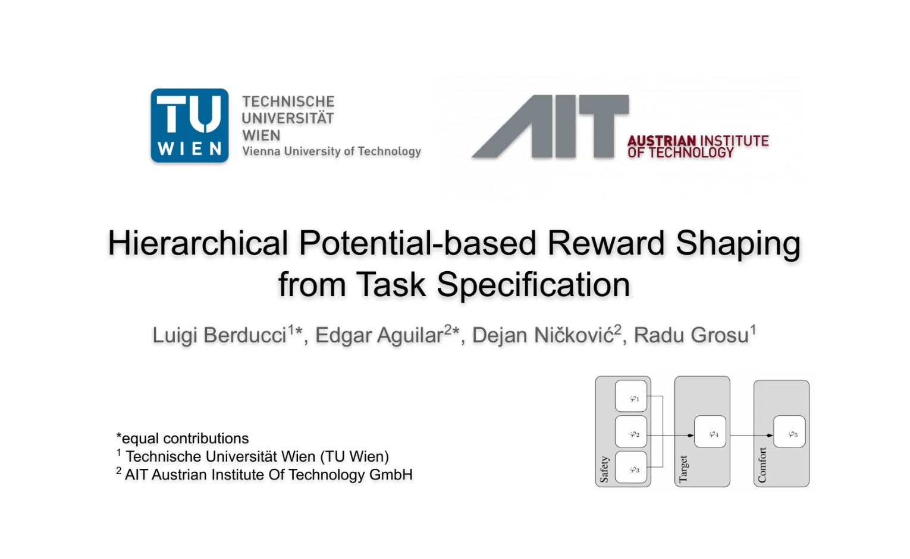

# Hierarchical Potential-based Reward Shaping

Experiments on automatic reward shaping from formal task specifications.

[](https://youtu.be/PWJxZEhlUj4)

Preprint available at [this link](https://arxiv.org/abs/2110.02792)

If you find this code useful, please reference in your paper:

```
@article{berducci2021hierarchical,
  title={Hierarchical Potential-based Reward Shaping from Task Specifications},
  author={Berducci, Luigi and Aguilar, Edgar A and Ni{\v{c}}kovi{\'c}, Dejan and Grosu, Radu},
  journal={arXiv e-prints},
  pages={arXiv--2110},
  year={2021}
}
```

## Installation 

We tested this implementation with `Python3.8` under `Ubuntu 20.04`.
To install the dependencies:

```pip install -r requirements.txt```

We assume you run the code from the project directory and that it is included in the `PYTHONPATH`.

## Run training 

To train on cartpole (for all the command line options, see `--help`):

```
python run_training.py --env cart_pole_obst --task fixed_height \ 
                       --reward hprs --steps 2000000 --expdir my_exp
```

This command will start the training for `2M` steps 
using the reward `hprs` (Hierarchical Potential-based Reward Shaping).
The results will be stored in the directory `logs/cart_pole_obst/my_exp`.


### Run training via Docker

To train via Docker:
- pull the image from Dockerhub: `docker pull luigiberducci/reward_shaping`
- or, build the image: `docker build -t reward_shaping .`

Then start the training:

```
docker run --name exp_cpole --rm -it \
	       -u $(id -u):$(id -g) -v $(pwd):/src \
	       --gpus all <image-name> \
	       /bin/bash entrypoint.sh my_exp cart_pole_obst fixed_height sac hprs 2000000 1
```


## Play with trained agents

The directory `checkpoints` contains a collection of trained agents for various environments.
For each environment, we report an agent trained with our `hprs` and an agent trained with the `default` shaped reward.
The performance of the various agents are comparable,
even if `hprs` is an automatic shaping methodology, while `default` is in most of the environment
the result of an engineered shaping.

We provide the script `eval_trained_models.py` for playing with those.
To run:
```
python eval_trained_models.py --checkpoint checkpoints/bipedal_walker_hardcore_hrs.zip --n_episodes 10
```

This command will evaluate the given model for `10` episodes, 
and report mean and std dev of the Policy Assessment Metric described in the paper.

